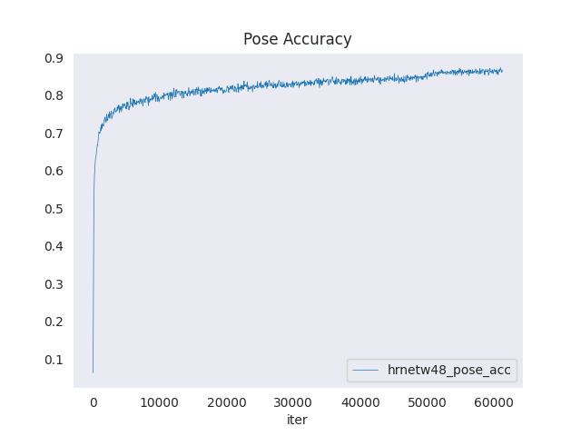

# Useful Tools Link

Apart from training/testing scripts, We provide lots of useful tools under the `tools/` directory.

<!-- TOC -->

- [Log Analysis](#log-analysis)
- [Model Complexity (experimental)](#model-complexity)
- [Model Conversion](#model-conversion)
  - [MMPose model to ONNX (experimental)](#mmpose-model-to-onnx--experimental-)
  - [Prepare a model for publishing](#prepare-a-model-for-publishing)
- [Miscellaneous](#miscellaneous)
  - [Evaluating a metric](#evaluating-a-metric)
  - [Print the entire config](#print-the-entire-config)

<!-- TOC -->

## Log Analysis

`tools/analysis/analyze_logs.py` plots loss/pose acc curves given a training log file. Run `pip install seaborn` first to install the dependency.



```shell
python tools/analysis/analyze_logs.py plot_curve ${JSON_LOGS} [--keys ${KEYS}] [--title ${TITLE}] [--legend ${LEGEND}] [--backend ${BACKEND}] [--style ${STYLE}] [--out ${OUT_FILE}]
```

Examples:

- Plot the mse loss of some run.

  ```shell
  python tools/analysis/analyze_logs.py plot_curve log.json --keys mse_loss --legend mse_loss
  ```

- Plot the acc of some run, and save the figure to a pdf.

  ```shell
  python tools/analysis/analyze_logs.py plot_curve log.json --keys acc_pose --out results.pdf
  ```

- Compare the acc of two runs in the same figure.

  ```shell
  python tools/analysis/analyze_logs.py plot_curve log1.json log2.json --keys acc_pose --legend run1 run2
  ```

You can also compute the average training speed.

```shell
python tools/analysis/analyze_logs.py cal_train_time ${JSON_LOGS} [--include-outliers]
```

- Compute the average training speed for a config file

  ```shell
  python tools/analysis/analyze_logs.py cal_train_time log.json
  ```

  The output is expected to be like the following.

  ```text
  -----Analyze train time of log.json-----
  slowest epoch 114, average time is 0.9662
  fastest epoch 16, average time is 0.7532
  time std over epochs is 0.0426
  average iter time: 0.8406 s/iter
  ```

## Model Complexity

`/tools/analysis/get_flops.py` is a script adapted from [flops-counter.pytorch](https://github.com/sovrasov/flops-counter.pytorch) to compute the FLOPs and params of a given model.

```shell
python tools/analysis/get_flops.py ${CONFIG_FILE} [--shape ${INPUT_SHAPE}]
```

We will get the result like this

```text

==============================
Input shape: (1, 3, 256, 192)
Flops: 8.9 GMac
Params: 28.04 M
==============================
```

**Note**: This tool is still experimental and we do not guarantee that the number is absolutely correct.
You may use the result for simple comparisons, but double check it before you adopt it in technical reports or papers.

(1) FLOPs are related to the input shape while parameters are not. The default input shape is (1, 3, 340, 256) for 2D recognizer, (1, 3, 32, 340, 256) for 3D recognizer.
(2) Some operators are not counted into FLOPs like GN and custom operators. Refer to [`mmcv.cnn.get_model_complexity_info()`](https://github.com/open-mmlab/mmcv/blob/master/mmcv/cnn/utils/flops_counter.py) for details.

## Model Conversion

### MMPose model to ONNX (experimental)

`/tools/deployment/pytorch2onnx.py` is a script to convert model to [ONNX](https://github.com/onnx/onnx) format.
It also supports comparing the output results between Pytorch and ONNX model for verification.
Run `pip install onnx onnxruntime` first to install the dependency.

```shell
python tools/deployment/pytorch2onnx.py $CONFIG_PATH $CHECKPOINT_PATH --shape $SHAPE --verify
```

### Prepare a model for publishing

`tools/publish_model.py` helps users to prepare their model for publishing.

Before you upload a model to AWS, you may want to:

(1) convert model weights to CPU tensors.
(2) delete the optimizer states.
(3) compute the hash of the checkpoint file and append the hash id to the filename.

```shell
python tools/publish_model.py ${INPUT_FILENAME} ${OUTPUT_FILENAME}
```

E.g.,

```shell
python tools/publish_model.py work_dirs/hrnet_w32_coco_256x192/latest.pth hrnet_w32_coco_256x192
```

The final output filename will be `hrnet_w32_coco_256x192-{hash id}_{time_stamp}.pth`.

## Miscellaneous

### Print the entire config

`tools/analysis/print_config.py` prints the whole config verbatim, expanding all its imports.

```shell
python tools/print_config.py ${CONFIG} [-h] [--options ${OPTIONS [OPTIONS...]}]
```
